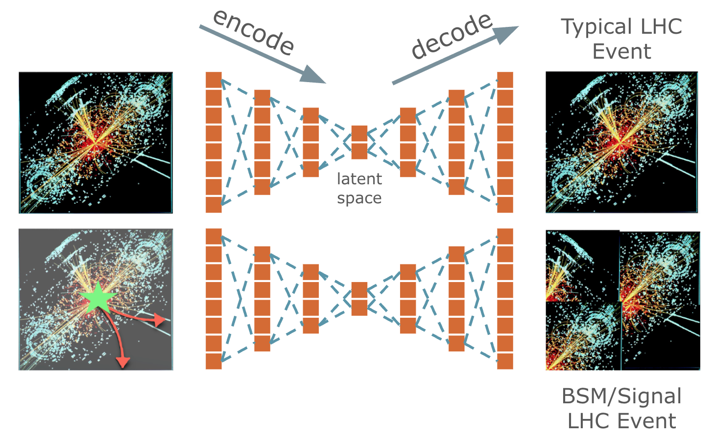
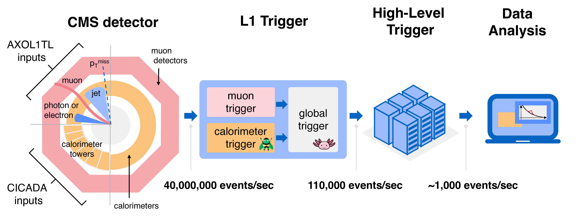
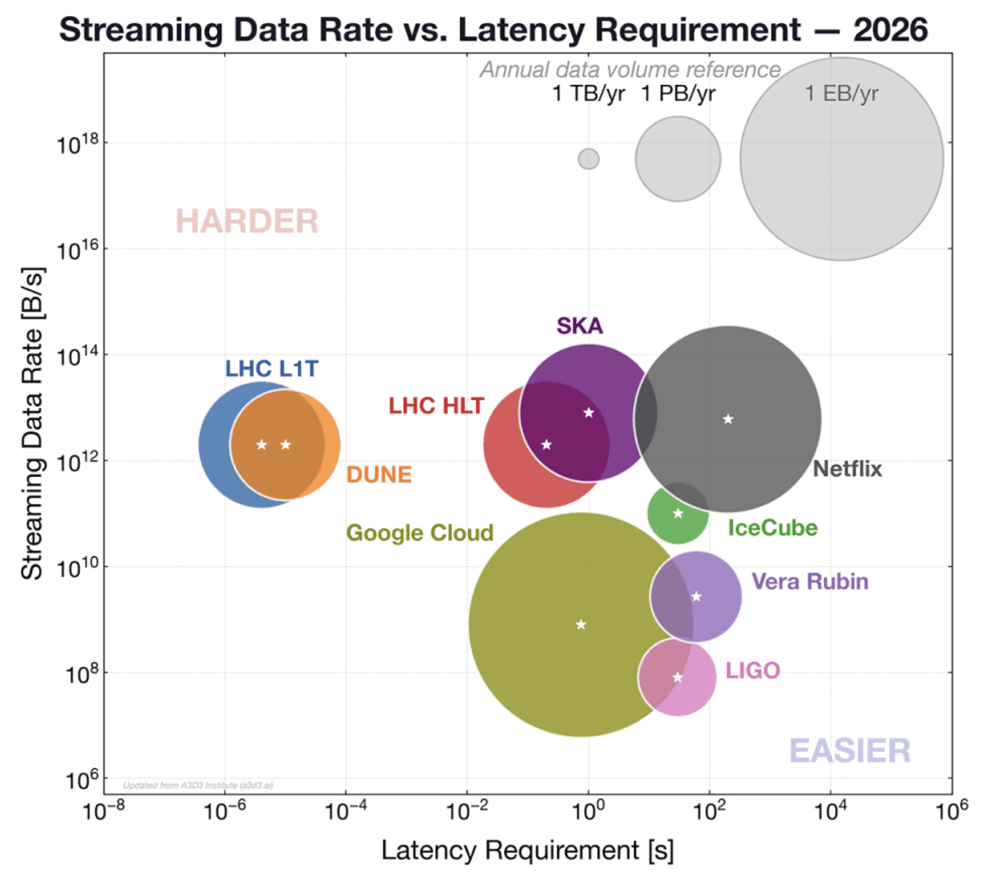

## Hackathon Project: Anomaly Detection at the CMS Level-1 Trigger

High-energy colliders, like the Large Hadron Collider, accelerate particles and smash them together, recreating early-universe conditions to search for new phenomena. These collisions generate more data than can be stored, so the CMS Level-1 Trigger system must decide what to keep within microseconds, retaining some events and discarding others permanently. Consequently, there is a danger of discarding new physics: if the next discovery looks unlike anything we have predicted, how can we design a trigger that knows to keep it?


### Anomaly Detection

One way to address this question is by designing a trigger which is an anomaly detection algorithm. Anomaly detection algorithms are typically designed around autoencoders, which is a machine learning model that compresses the input down to a low-dimensional latent space and then decompresses the latent space representation to match the input as closely as possible.



### CMS Level-1 Trigger Requirements





Look at the config files in `config/`. They define three datasets:
- `baseline`: train on one run of real zero-bias collision data
- `combined`: train on both zero-bias runs
- `simulation`: train on *simulated* zero-bias events (SingleNeutrino), evaluate on real data

All three evaluate on the same zero-bias test data and the same set of simulated signals
(new-physics scenarios the model never sees during training).

<!-- TODO(organisers): the research question. For example:
The goal is to train a model that flags signal events as anomalous while keeping only a small fraction
of normal events. In particular, we want to compare:
- the models in `models/` (dense autoencoder, tiny autoencoder, PCA, isolation forest)
- a model trained on real data vs. one trained on simulation
The question is: ...
-->

### Getting started

1. Clone the repository in JupyterLab and open [`setup.ipynb`](setup.ipynb). It creates a virtual
   environment, registers it as a Jupyter kernel, checks the GPU and downloads the data.
2. [`explore_data.ipynb`](explore_data.ipynb): a tour of the dataset.
3. [`train.ipynb`](train.ipynb): train a model step by step (same as `train.py`).
4. [`evaluate.ipynb`](evaluate.ipynb): compare models (same as `evaluate.py`).

Once things work in the notebooks, run longer trainings with the scripts:

```bash
python train.py --model dense-ae --epochs 20 --data-config config/baseline.yml --output output/baseline/
python evaluate.py
```

`run-training.sh` trains several models in one go. Add your own models in `models/` with the
`@register(...)` decorator so `train.py` and `evaluate.py` can find them.

### Repository layout

| File | What it does |
|---|---|
| `config/*.yml` | data configs: which samples to train / validate / test on, input layout, scaling |
| `dataset.py` | download the data and read it into arrays (awkward / numpy) |
| `dataloader.py` | turn a data config into PyTorch DataLoaders |
| `models/` | model definitions (`autoencoder.py`, `sklearn_wrapper.py`) and the model registry |
| `train.py` | train a model, saving the best one to `--output` |
| `evaluate.py` | signal efficiency at a fixed zero-bias acceptance, ROC curves, score plots |
| `plotting.py`, `utils.py` | helpers |

### The dataset

[CMS L1T anomaly detection dataset](https://huggingface.co/datasets/CERN/anomaly_detection_cmsl1t)
([Zenodo DOI 10.5281/zenodo.21787779](https://doi.org/10.5281/zenodo.21787779)), released under CC0.
It contains Level-1 trigger objects (up to 8 muons, 12 jets, 12 e-gammas and 12 taus, plus energy sums)
for zero-bias collision data from 2025, a simulation of it, and 20 simulated signal samples.
See the dataset card for details.

<!-- TODO(organisers): rules, schedule, contact. -->

### Citation

```bibtex
@dataset{cms_l1t_anomaly_2026,
  author    = {{CMS Collaboration}},
  title     = {Trigger Anomaly Detection for New Physics at the Large Hadron Collider},
  year      = {2026},
  publisher = {Zenodo},
  version   = {1.0},
  doi       = {10.5281/zenodo.21787779},
  url       = {https://doi.org/10.5281/zenodo.21787779}
}
```
